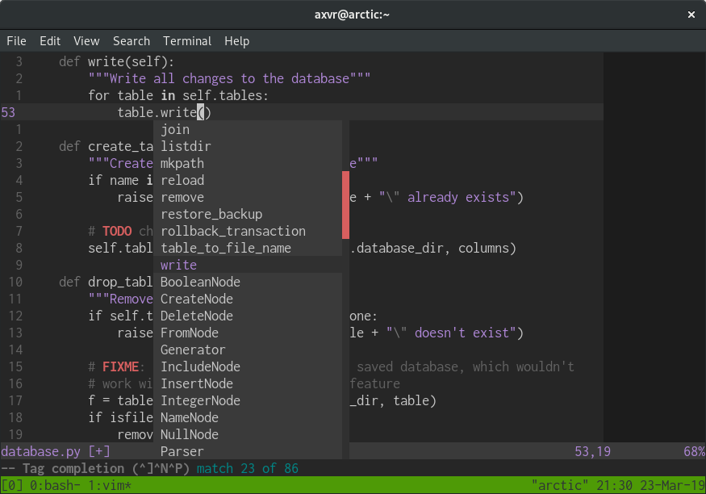

# Photon.vim

A minimal and elegant dark colour scheme for Vim.



## Usage

```vim
colorscheme photon
```

## Attribution

Based on the [paramount][] and [space-vim-dark][] colour schemes. Made possible
thanks to [Romain Lafourcade][]'s fantastic [RNB][] Vim colour scheme template.

[paramount]: https://github.com/owickstrom/vim-colors-paramount
[space-vim-dark]: https://github.com/liuchengxu/space-vim-dark
[Romain Lafourcade]: https://github.com/romainl
[RNB]: https://gist.github.com/romainl/5cd2f4ec222805f49eca
